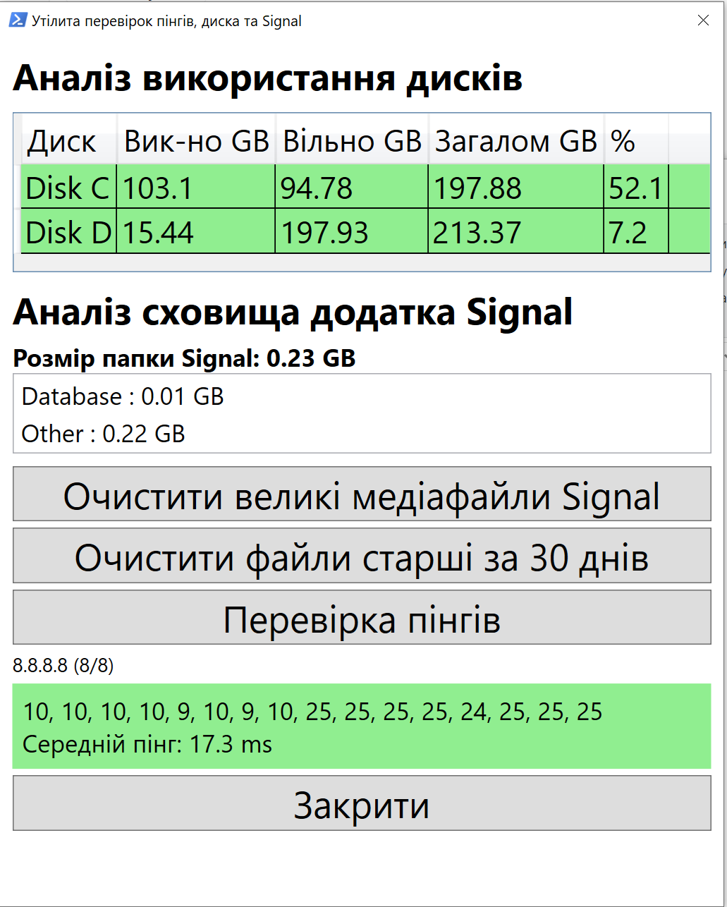

# Disk & Signal Analyzer

A lightweight Windows utility written in **PowerShell** and **WPF** for analyzing disk usage, managing Signal Desktop storage, and testing network latency.

## Screenshot



## Features

* Analyze disk usage for all local drives
* Display used, free and total disk space
* Color-code disks based on usage level
* Analyze Signal Desktop storage
* Categorize Signal files (Images, Video, Audio, Database, Large Media, Other)
* Highlight Large Media files
* Delete Large Media files
* Delete files older than 30 days
* Built-in network ping tester
* Ping both **1.1.1.1** and **8.8.8.8**
* Display average latency
* Progress bar during ping test
* Simple WPF graphical interface
* No installation required

## Requirements

* Windows 10 or Windows 11
* Windows PowerShell 5.1 or newer
* Signal Desktop (optional)

## Running

### Option 1

Run from PowerShell:

```powershell
powershell.exe -ExecutionPolicy Bypass -File disk_signal.ps1
```

### Option 2

Double-click:

```text
run_disk_signal.vbs
```

The VBScript starts the application without displaying the PowerShell console window.

## Project Status

This project is actively being improved.

### Planned features

* Export reports
* Better Signal media classification
* Network quality statistics
* Packet loss detection
* Jitter calculation
* Automatic update checker
* Executable (.exe) release

## License

This project is released under the MIT License.
